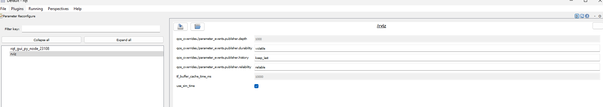

## ROS Tools

### Rviz
```
local_setup.bat
cd bin
rviz2.exe
```

### Rqt
```
local_setup.bat
cd Scripts
rqt.exe
```

### Usefull process & commands
Reconfigure parametrer for set rviz in simulation time


Set param on rviz (after rviz is launch to activate simulation time on rviz)

```
ros2 param set /rviz use_sim_time true
```
