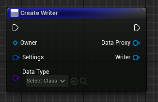
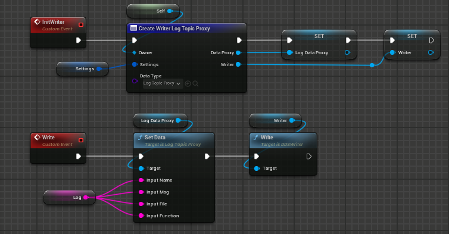
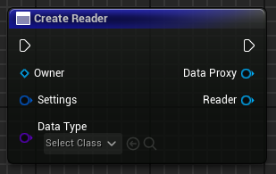
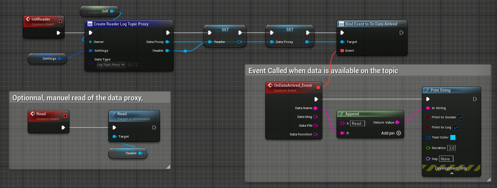
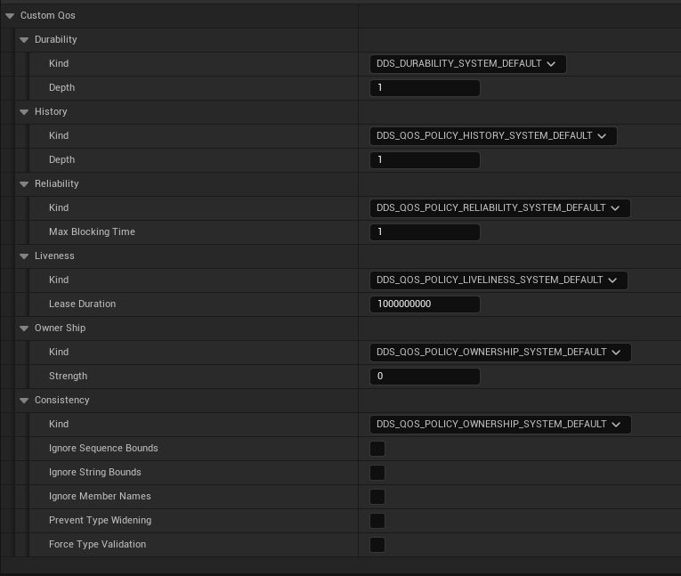
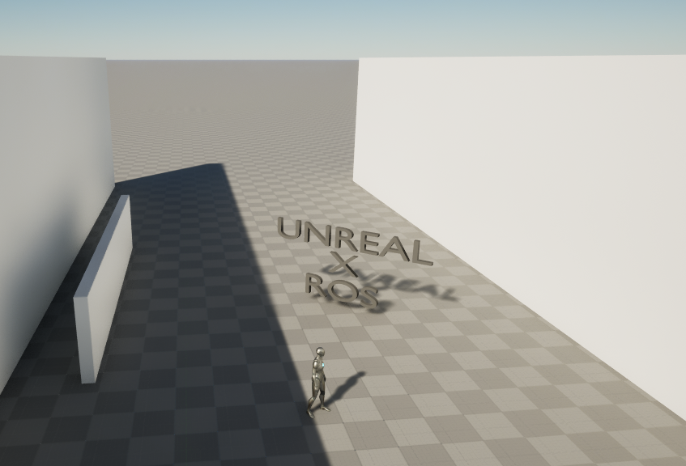
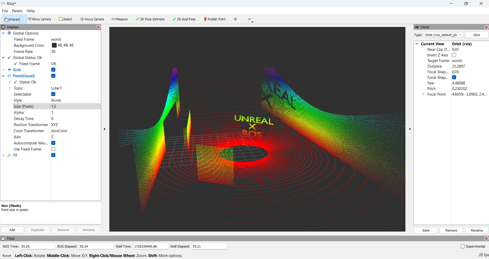
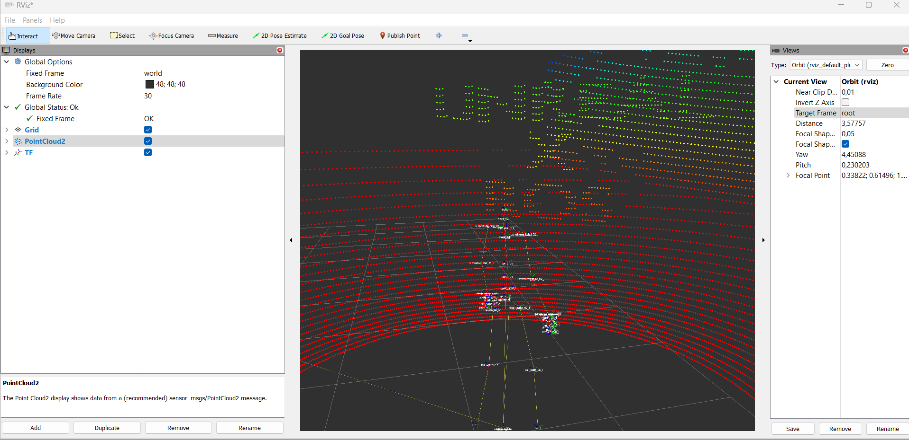

<h1 align="center">MORSE</h1>

⭐ Star on GitHub — it motivates a lot!

[](https://x.com/intent/tweet?text=Check%20out%20this%20cool%20project%20on%20GitHub!%20https://github.com/NicoBrug/Morse%20%23UnrealEngine%20%23DDS%20%23Standarts)
[](https://www.linkedin.com/sharing/share-offsite/?url=https://github.com/NicoBrug/Morse)

## Table of Contents
- [About](#-about)
- [Installation](#-installation)
- [Documentation](#-documentation)
- - [Settings](#morse-settings)
- - [Blueprint API Reference](#blueprint-api-reference)
- - [C++ API Reference](#c-api-reference)
- - [Interface Definition and Language Mapping](#interface-definition-and-language-mapping)
- [Exemples](#-exemples)
- [Contact](#-contact)

## 🚀 About

Morse is an Unreal Engine plugin designed for creating distributed simulation systems. It is built on the industrial standard [DDS (Data Distribution Service)](https://www.omg.org/spec/DDS/) for synchronizing data across networks.  
Morse simplifies data sharing within distributed systems and can, among other capabilities, integrate with frameworks that also utilize DDS middleware, such as the [ROS](https://www.ros.org/) robotics development framework.

Additional plugins are under development, particularly for robotic simulation and synchronization with ROS.

See the standards specification :
- **DDS Specification**: https://www.omg.org/omg-dds-portal/
- **IDL Specification**: https://www.omg.org/spec/IDL/4.2/About-IDL


Additionals plugins :
- ROS Data Model : https://github.com/NicoBrug/MorseROSDataModel
- IDL to Unreal Translator : 🔜
- Robotic Simulation : 🔜


## ✅ Installation

Morse has no direct dependencies on ROS and is built on the CycloneDDS implementation of DDS.
To install Morse in a project, simply download the plugin and add it to the project's plugins folder.

Download Zip on the repo and put it in you're Plugins Folder

OR 

Go to : YoureProject/Plugins
```
git clone https://github.com/NicoBrug/Morse.git
```

Rebuild you're solution.

## 📚 Documentation

If you want to see the website documentation : [Link]

### Morse Settings

### Blueprint API Reference

All the blueprint API is accessibles type "morse" in the blueprint actions.


#### DDS Writer Graph Nodes
This section describes the process of creating a Writer object, which manages the actions of writing data to the Data Distribution Service (DDS). The data type is specified as an input parameter to the function (DataType). The Settings parameter includes the Quality of Service (QoS) settings and the name of the topic on which the data will be published.




To send data using the Writer object, you need to set the data on your data proxy. Once the data is configured, you can invoke the Write function within the Writer to publish the data to the specified topic.



#### DDS Reader Graph Nodes
This section describes the process of creating a Reader object, which manages the actions of reading data from the Data Distribution Service (DDS). The data type to be read is specified as an input parameter to the function (DataType). The Settings parameter includes the Quality of Service (QoS) settings and the name of the topic from which we want to receive data.



To retrieve data from DDS, you have two options:

* Bind a Delegate: You can bind a delegate that is triggered when data becomes available on the topic. This approach treats the Reader object as a subscriber, allowing you to react to incoming data in real-time.

* Manual Retrieval: Alternatively, you can manually retrieve the data by calling the Read function on the Reader object. After executing this function, you can access the data within the data proxy.




#### DDS Quality Of Service Settings



### C++ API Reference
#### Write Data on DDS
Add the include for DDS Writer
```
#include "Topic/DDSWriter.h" 
```
For create a DDS Writer, you need to setup the settings of the topic you want to write on.
The Settings is contain in a struct called FTopicDescription.
```
UMorseLib::CreateWriter(Owner, Settings, UDataProxy::StaticClass(), Writer);
```
Operation of writing the data inside the topic proxy on DDS. Before that, you can modify the data inside the topic proxy.
```
Writer->Write();
```

#### Read
Add the include for DDS Reader
```
#include "Topic/DDSReader.h" 
```
Create Reader
```
UMorseLib::CreateReader(this, Settings, UDataProxy::StaticClass(), TopicProxy, Reader);
```
Operation of reading on DDS. The read are goind to get the data on DDS and set up inside the topic proxy object. The updated data is acessible after this operation.
```
Reader->Read();
```

#### Configure QOS
Add the include for the topic
```
#include "Topic/DDSTopic.h" 
```
Define a custom and reusable QOS.
```
inline FQoSInfo QOS_TIME = FQoSInfo{
    FQoSDurability{EQosDurability::VOLATILE, 1},						// Volatile data
    FQoSHistory{EQosHistory::KEEP_ALL, 0},							    // Keep all samples
    FQoSReliability{EQosReliability::BEST_EFFORT, 0},		            // No blocking
    FQoSLiveness{EQosLiveness::MANUAL_BY_TOPIC, 1000000000},	        // 1 second lease duration
    FQoSOwnership{EQosOwnership::SYSTEM_DEFAULT, 1},
    FQoSConsistency{EQosConsistency::SYSTEM_DEFAULT,false, false,false,false}
};

FTopicDescription Settings;
Settings.SetName("rt/clock");
Settings.SetQualityOfService(QOS_TIME);
```

### Interface Definition and Language Mapping

A part of the IDL (Interface Definition Language) standard specification is implemented in Morse, enabling the description of interfaces between various software components.

Morse supports certain elements of the IDL 4.2 standard, available at https://www.omg.org/spec/IDL/4.2. The aim of this article is to clarify the various sections supported by Morse. Whatever is not listed below is probably not supported at the moment.
For build the data you need to things : 
- Idl C Compiler (use the CycloneCompiler https://github.com/eclipse-cyclonedds/cyclonedds) 
- Idl To Unreal Translator (available soon), you can write you're own data and make the translation by hand. It's more time consuming.

You have plenty exemple of how write these data in the [MorseROSDataModel](https://github.com/NicoBrug/MorseROSDataModel) depot.
The MorseROSDataModel is the classic way to add Custom Data Model on top of Morse.

#### Exemple
```
#include "GeoData/Position.idl"

module Simulation {
  module World {
    enum WeatherState
    {
        RAIN, 
        SNOW,
        SUN
    };
    struct Terrain {
      string Name;
      GeoData::Position Center; 
      sequence<uint8> HeightData;
    };
  };
};
```

## 🔨 Exemples
Here are some examples of using Morse for robotic system simulation with native connection to ROS.
This example was built using the ROS Data Model plugin (MorseRosDataModel).
A simulation layer, specifically for sensor simulation and frame synchronization, has been implemented in a separate plugin.
Therefore, this example adn the robotic simulation is not included in the plugin; it serves as an illustration of what is possible to achieve.

This example was created on Windows 11 with:

    ROS Humble Version
    Unreal Engine 5.4
    Morse alpha
    Morse ROS Data Model

This example demonstrates the synchronization of an Unreal environment, containing two simulated LIDARs, and the synchronization of the Unreal mannequin with Rviz2.

Unreal Engine Environment

Rviz2 : Time, Frames, Lidar synchronisation



## 📫 Contact

If you have any questions, feedback, or inquiries about this project, feel free to reach out via the following methods:

- **Email**: [nicolasbrugie@gmail.com](mailto:nicolasbrugie@gmail.com)
- **LinkedIn**: [Brugie Nicolas](https://www.linkedin.com/in/your-profile/)
- **GitHub Issues**: [Open an Issue](https://github.com/NicoBrug/Morse/issues)