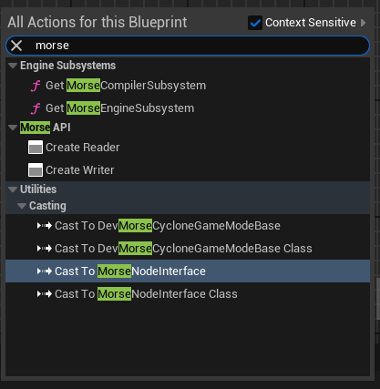

<h1 align="center">MORSE</h1>
<h3 align="center">A Distributed Simulation Framework for Unreal Engine</h3>

<p align="center">
  <a href="" target="_blank">
    
  </a>
  <a href="">
    
  </a>
  <a href="">
    
  </a>
</p>

## Table of Contents
- [About](#-about)
- [Installation](#-installation)
- [Documentation](#-documentation)
- - [Settings](#morse-settings)
- - [Blueprint API Reference](#blueprint-api-reference)
- - [C++ API Reference](#c-api-reference)
- - [Interface Definition and Language Mapping](#interface-definition-and-language-mapping)
- [Exemples](#-exemples)
- [Contact](#-contact)

## 🚀 About

Morse is a framework designed for building simulation software and integrating Unreal Engine into distributed  environments. It provides a structured implementation approach that allows you to:
- Integrate interfaces and data models defined by the [IDL (Interface Definition Language)](https://www.omg.org/spec/IDL/4.2/About-IDL) standard directly into Unreal Engine, making them accessible in both Blueprints and C++.
- Communicate with external systems using the [DDS (Data Distribution Service)](https://www.omg.org/spec/DDS/) through a Blueprint and C++ API.

A practical example of Morse, is the integration of the ROS data model to synchronize data between the ROS framework and an Unreal Engine application. This ROS data model has been added as a dedicated module within Morse (see Exemple).

<p align="center">
  <i>Please consider leaving a star if you loved this project! </i>⭐
</p>


### Morse Framework Component : 
- [Morse Core](https://github.com/NicoBrug/Morse) : Contains the core of Morse, including the middleware and APIs.
- [ROS Data Model](https://github.com/NicoBrug/MorseROSDataModel) : A plugin that implements the ROS data model for Morse.
- IDL to Unreal Translator 🔜 : A plugin that enables the automatic integration of IDL files into Unreal Engine. 
- Robotic Simulation 🔜 : A plugin that provides a robotics simulation layer within Unreal Engine.

Morse is built on [Cyclone DDS](https://cyclonedds.io/) and does not introduce any additional external dependencies.

### Future Development :
Additional plugins, such as the IDL to Unreal Translator and Robotic Simulation, are currently in development. Stay tuned! 

### Standart & References : 

See the standards specification :
- **DDS Specification**: https://www.omg.org/omg-dds-portal/
- **IDL Specification**: https://www.omg.org/spec/IDL/4.2/About-IDL
- **Cyclone DDS**: https://cyclonedds.io/


## ✅ Installation

Morse has no direct dependencies on ROS and is built on the CycloneDDS implementation of DDS.
To install Morse in a project, simply download the plugin and add it to the project's plugins folder.

Download Zip on the repo and put it in you're Plugins Folder

OR 

Go to : YoureProject/Plugins
```
git clone https://github.com/NicoBrug/Morse.git
```

Rebuild you're solution.

## 📚 Documentation

If you want to see the website documentation : [Link]

### Morse Settings
The following parameters can be configured in the project configuration file. You can adjust them via the `DefaultGame.ini` file or within the Unreal Engine Editor.

| Parameter                | Type                | Description                                                                 | Default Value              |
|--------------------------|---------------------|-----------------------------------------------------------------------------|----------------------------|
| **DDSDomainConfigPath**   | `FString`           | Path to the DDS configuration file.                                          | `"C:/path/to/dds/config.xml"` |
| **OverrideDDSXmlConf**    | `bool`              | Determines whether the DDS XML configuration should be overridden.            | `true`                     |
| **DomainId**              | `int`               | The DDS domain ID to use.                                                   | `DDS_DOMAIN_DEFAULT`       |
| **LogsVerbosity**         | `EDDSVerbosity`     | The verbosity level of logs for DDS. Activated only if `OverrideDDSXmlConf` is `true`. | `Info`                     |
|                          |                     | Options available: `None`, `Error`, `Warning`, `Info`, `Debug`, `Trace`.    |                            |

### Blueprint API Reference

All the blueprint API is accessibles type "morse" in the blueprint actions.



#### DDS Writer Graph Nodes
This section describes the process of creating a Writer object, which manages the actions of writing data to the Data Distribution Service (DDS). The data type is specified as an input parameter to the function (DataType). The Settings parameter includes the Quality of Service (QoS) settings and the name of the topic on which the data will be published.


To send data using the Writer object, you need to set the data on your data proxy. Once the data is configured, you can invoke the Write function within the Writer to publish the data to the specified topic.


#### DDS Reader Graph Nodes
This section describes the process of creating a Reader object, which manages the actions of reading data from the Data Distribution Service (DDS). The data type to be read is specified as an input parameter to the function (DataType). The Settings parameter includes the Quality of Service (QoS) settings and the name of the topic from which we want to receive data.


To retrieve data from DDS, you have two options:

* Bind a Delegate: You can bind a delegate that is triggered when data becomes available on the topic. This approach treats the Reader object as a subscriber, allowing you to react to incoming data in real-time.

* Manual Retrieval: Alternatively, you can manually retrieve the data by calling the Read function on the Reader object. After executing this function, you can access the data within the data proxy.


#### DDS Quality Of Service Settings


### C++ API Reference
#### Write Data on DDS
Add the include for DDS Writer
```
#include "Topic/DDSWriter.h" 
```
For create a DDS Writer, you need to setup the settings of the topic you want to write on.
The Settings is contain in a struct called FTopicDescription.
```
UMorseLib::CreateWriter(Owner, Settings, UDataProxy::StaticClass(), Writer);
```
Operation of writing the data inside the topic proxy on DDS. Before that, you can modify the data inside the topic proxy.
```
Writer->Write();
```

#### Read
Add the include for DDS Reader
```
#include "Topic/DDSReader.h" 
```
Create Reader
```
UMorseLib::CreateReader(this, Settings, UDataProxy::StaticClass(), TopicProxy, Reader);
```
Operation of reading on DDS. The read are goind to get the data on DDS and set up inside the topic proxy object. The updated data is acessible after this operation.
```
Reader->Read();
```

#### Configure QOS
Add the include for the topic
```
#include "Topic/DDSTopic.h" 
```
Define a custom and reusable QOS.
```
inline FQoSInfo QOS_TIME = FQoSInfo{
    FQoSDurability{EQosDurability::VOLATILE, 1},						// Volatile data
    FQoSHistory{EQosHistory::KEEP_ALL, 0},							    // Keep all samples
    FQoSReliability{EQosReliability::BEST_EFFORT, 0},		            // No blocking
    FQoSLiveness{EQosLiveness::MANUAL_BY_TOPIC, 1000000000},	        // 1 second lease duration
    FQoSOwnership{EQosOwnership::SYSTEM_DEFAULT, 1},
    FQoSConsistency{EQosConsistency::SYSTEM_DEFAULT,false, false,false,false}
};

FTopicDescription Settings;
Settings.SetName("rt/clock");
Settings.SetQualityOfService(QOS_TIME);
```

### Interface Definition and Language Mapping

A part of the IDL (Interface Definition Language) standard specification is implemented in Morse, enabling the description of interfaces between various software components.

Morse supports certain elements of the IDL 4.2 standard, available at https://www.omg.org/spec/IDL/4.2. The aim of this article is to clarify the various sections supported by Morse. Whatever is not listed below is probably not supported at the moment.
For build the data you need to things : 
- Idl C Compiler (use the CycloneCompiler https://github.com/eclipse-cyclonedds/cyclonedds) 
- Idl To Unreal Translator (available soon), you can write you're own data and make the translation by hand. It's more time consuming.

You have plenty exemple of how write these data in the [MorseROSDataModel](https://github.com/NicoBrug/MorseROSDataModel) depot.
The MorseROSDataModel is the classic way to add Custom Data Model on top of Morse.

#### Exemple
```
#include "GeoData/Position.idl"

module Simulation {
  module World {
    enum WeatherState
    {
        RAIN, 
        SNOW,
        SUN
    };
    struct Terrain {
      string Name;
      GeoData::Position Center; 
      sequence<uint8> HeightData;
    };
  };
};
```

## 🔨 Exemples
Here are some examples of using Morse for robotic system simulation with native connection to ROS.
This example was built using the ROS Data Model plugin (MorseRosDataModel).
A simulation layer, specifically for sensor simulation and frame synchronization, has been implemented in a separate plugin.
Therefore, this example adn the robotic simulation is not included in the plugin; it serves as an illustration of what is possible to achieve.

This example was realised on Windows 11 with:
*  ROS Humble Version
* Unreal Engine 5.4
* Morse
* Morse ROS Data Model

This example demonstrates the synchronization of an Unreal environment, containing two simulated LIDARs, and the synchronization of the Unreal mannequin with Rviz2.

Unreal Engine Environment

Rviz2 : Time, Frames, Lidar synchronisation


## 📫 Contact

If you have any questions, feedback, or inquiries about this project, feel free to reach out via the following methods:

- **Email**: [nicolasbrugie@gmail.com](mailto:nicolasbrugie@gmail.com)
- **LinkedIn**: [Brugie Nicolas](https://www.linkedin.com/in/nicolas-brugie/)
- **GitHub Issues**: [Open an Issue](https://github.com/NicoBrug/Morse/issues)


## 📝 License ##

This project is licensed under the [Apache License 2.0](https://www.apache.org/licenses/LICENSE-2.0). Please refer to the [LICENSE](LICENSE) file for further details.